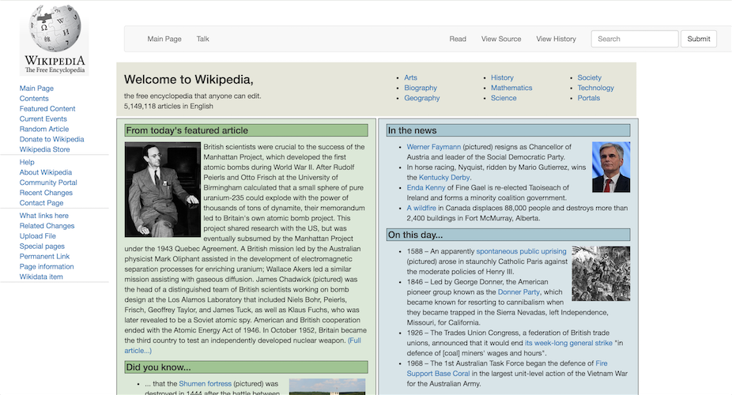

# Project Name
Wiki Dummy Page

## Description
This is a pair programming project created to practice bootstrap. We tried our best to recreate the wiki home page.

## Languages
CSS, Bootstrap, and JavaScript.

## Usage
To view the site, you can go to: https://mehequanna.github.io/practice-wiki-dummy.
To use the code, you can clone the repository at [https://github.com/Mehequanna/practice-wiki-dummy](https://github.com/Mehequanna/practice-wiki-dummy).
Fork the repository and double click on index.html.

## Author/s
Stephen Emery and Matt Botz

## License
This work can be used under the The MIT License.
Copyright (c) 2016 Matt Botz & Stephen Emery
